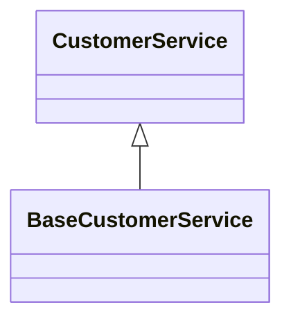
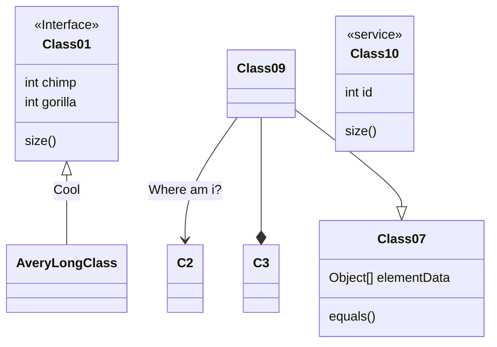

# Getting Started with Spring WebFlux

Overview

## Description
### Dependencies
- org.springframework.boot
  - spring-boot-starter-data-mongodb-reactive
  - spring-boot-starter-data-r2dbc
  - spring-boot-starter-webflux
- io.r2dbc:r2dbc-postgresql
- org.postgresql:postgresql

### Components
#### CustomerService Interface

#### BaseCustomerService

## Demo

## Features

- feature:1
- feature:2

## Requirement

## Usage

## Installation

## References

## Licence

Released under the [MIT license](https://gist.githubusercontent.com/shinyay/56e54ee4c0e22db8211e05e70a63247e/raw/34c6fdd50d54aa8e23560c296424aeb61599aa71/LICENSE)

## Author

[shinyay](https://github.com/shinyay)
- twitter: https://twitter.com/yanashin18618
